# アーキテクチャガイド

`travel_booking` モノレポを構成する **Flutter モバイルアプリ**（`travel_booking_mobile`）と **Node.js バックエンド**（`travel_booking_backend`）のアーキテクチャをまとめたドキュメントです。

---

## 目次

1. [システム全体像](#1-システム全体像)
2. [Mobile アーキテクチャ](#2-mobile-アーキテクチャ)
3. [Backend アーキテクチャ](#3-backend-アーキテクチャ)
4. [Mobile ↔ Backend 通信設計](#4-mobile--backend-通信設計)
5. [テスト戦略](#5-テスト戦略)
6. [Widgetbook Preview 環境](#6-widgetbook-preview-環境)

---

## 1. システム全体像

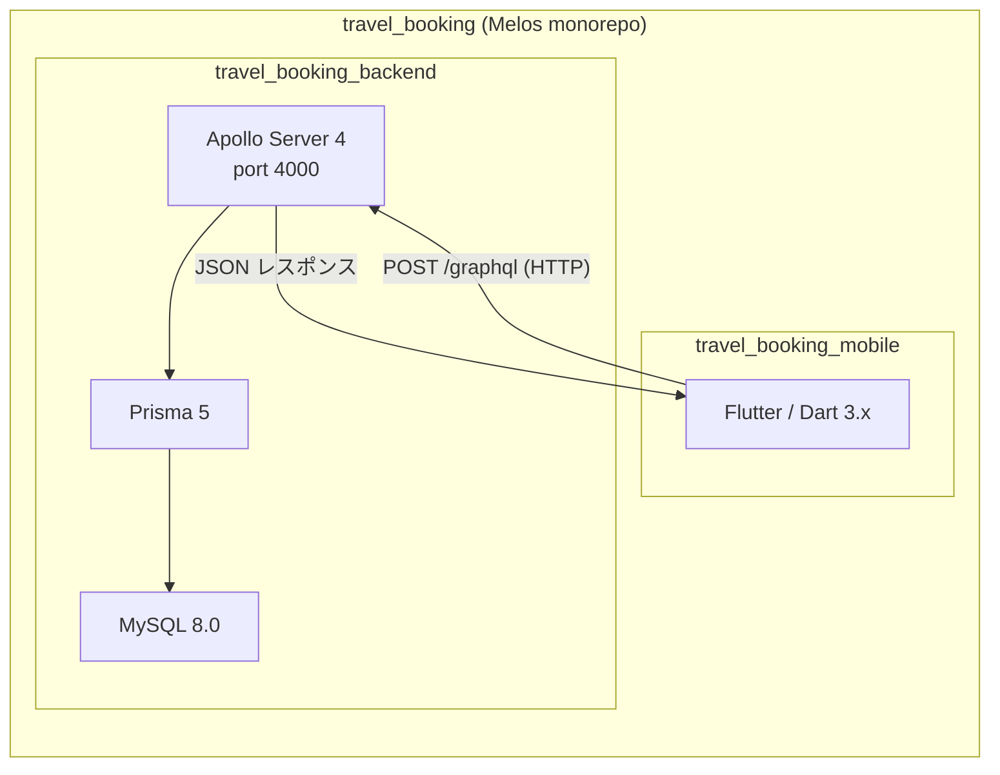

| | Mobile | Backend |
|---|---|---|
| 言語 | Dart 3.x | TypeScript 5.x |
| フレームワーク | Flutter 3.x | Apollo Server 4.x |
| 状態管理 | Riverpod 3.x | — |
| 通信 | `dart:io HttpClient`（手書き GraphQL） | — |
| ローカル永続化 | SharedPreferences | — |
| DB | — | MySQL 8.0 + Prisma 5.x |
| インフラ | — | Docker Compose |

---

## 2. Mobile アーキテクチャ

### 2-1. レイヤー構成

採用パターンは **MVVM + Repository** の 3 層構造です。依存方向は常に **上から下** の一方向です。

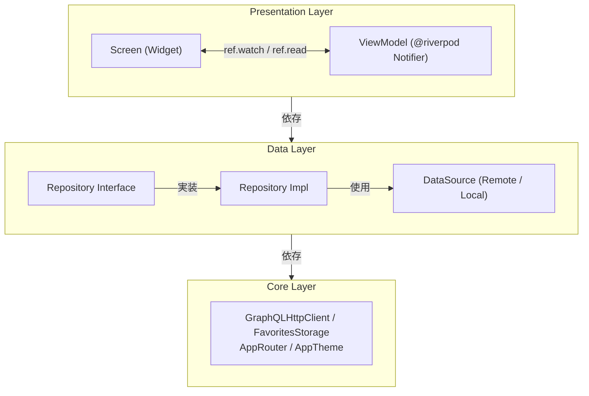

### 2-2. ディレクトリ構成

```
lib/
├── main.dart
├── app.dart                              # ProviderScope + MaterialApp.router
│
├── core/
│   ├── config/graphql_config.dart        # GraphQLHttpClient
│   ├── database/app_database.dart        # FavoritesStorage（SharedPreferences ラッパー）
│   ├── router/app_router.dart            # go_router ルート定義
│   └── theme/app_theme.dart             # テーマ定数
│
├── data/
│   ├── models/                           # データモデル（手書き fromJson / toJson）
│   │   ├── travel_plan.dart
│   │   ├── favorite_plan.dart
│   │   ├── booking.dart
│   │   ├── plan_filter.dart
│   │   ├── travel_plan_image.dart
│   │   ├── itinerary_day.dart / itinerary_activity.dart
│   │   └── review.dart
│   ├── datasources/
│   │   ├── remote/travel_plan_remote_datasource.dart   # GraphQL クエリ / ミューテーション
│   │   └── local/favorite_local_datasource.dart        # SharedPreferences + Stream
│   └── repositories/
│       ├── travel_plan_repository.dart          # インターフェース
│       ├── travel_plan_repository_impl.dart     # 実装
│       ├── favorite_repository.dart             # インターフェース
│       └── favorite_repository_impl.dart        # 実装
│
└── presentation/
    ├── viewmodels/                        # @riverpod Notifier（.g.dart 自動生成）
    │   ├── plan_list_viewmodel.dart       # Provider 定義も集約
    │   ├── plan_detail_viewmodel.dart
    │   ├── booking_viewmodel.dart
    │   └── favorite_viewmodel.dart
    ├── screens/
    │   ├── home/                          # プラン一覧 + フィルター
    │   ├── plan_detail/                   # プラン詳細
    │   ├── booking/                       # 予約フォーム + 完了画面
    │   └── favorites/                     # お気に入り一覧
    └── widgets/                           # 共通ウィジェット
        ├── rating_stars.dart
        ├── loading_indicator.dart
        └── app_error_widget.dart

preview/                                   # Widgetbook Preview 環境（開発用）
├── main.dart                              # Widgetbook エントリポイント（@widgetbook.App）
├── mock_data.dart                         # プレビュー用モックプラン 3 件
├── mock_providers.dart                    # FakeInMemoryFavoritesStorage + previewProviderOverrides
├── main.directories.g.dart               # build_runner 自動生成 ← 手動編集禁止
└── components/                            # UseCase 定義（@widgetbook.UseCase）
    ├── rating_stars_preview.dart          # 3 UseCase
    ├── loading_indicator_preview.dart     # 2 UseCase
    ├── app_error_widget_preview.dart      # 2 UseCase
    └── plan_card_preview.dart             # 3 UseCase
```

---

### 2-3. Data Layer

#### モデル

freezed は使用せず、すべて手書きの `fromJson` / `toJson` / `copyWith` で実装しています。

| モデル | 用途 | 備考 |
|---|---|---|
| `TravelPlan` | プラン全体（一覧・詳細で共通） | `hasDiscount`, `primaryImageUrl` を computed property として定義 |
| `FavoritePlan` | お気に入り保存用 | `TravelPlan` のサブセット。`savedAt` を追加保持 |
| `Booking` | 予約情報 | `status: PENDING → CONFIRMED → CANCELLED` |
| `PlanFilter` | 検索フィルター条件 | `toGraphQLVariables()` で GraphQL 変数に変換 |
| `ItineraryDay` / `ItineraryActivity` | 旅程の日程・アクティビティ | ネスト構造 |
| `Review` | 口コミ | `reviewerName`, `rating`, `comment` |

#### DataSource

**`TravelPlanRemoteDataSource`**

GraphQL のクエリ・ミューテーション文字列を `static const` として保持し、`GraphQLHttpClient` 経由で実行します。

| メソッド | GraphQL オペレーション | 戻り値 |
|---|---|---|
| `getTravelPlans(filter, page, pageSize)` | `query GetTravelPlans` | `(List<TravelPlan>, totalCount, hasNextPage, totalPages)` ※ Record 型 |
| `getTravelPlan(id)` | `query GetTravelPlan` | `TravelPlan` |
| `createBooking(...)` | `mutation CreateBooking` | `Booking` |
| `cancelBooking(id)` | `mutation CancelBooking` | `void` |

**`FavoriteLocalDataSource`**

`FavoritesStorage`（SharedPreferences）を保持し、`StreamController.broadcast()` で変更をリアルタイム通知します。

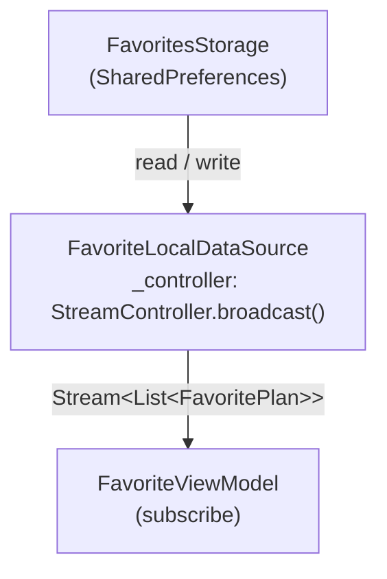

`watchFavorites()` は呼び出し時に `_emitCurrent()` を実行するため、新規サブスクライバーが購読直後に最新状態を受け取れます。

#### Repository

インターフェースと実装をペアで定義し、Riverpod Provider で DI します。

| インターフェース | 実装クラス | 主なメソッド |
|---|---|---|
| `TravelPlanRepository` | `TravelPlanRepositoryImpl` | `getPlans`, `getPlan`, `createBooking`, `cancelBooking` |
| `FavoriteRepository` | `FavoriteRepositoryImpl` | `watchFavorites`, `isFavorite`, `addFavorite`, `removeFavorite`, `clearFavorites` |

---

### 2-4. Presentation Layer

#### ViewModel 一覧

| ViewModel | State クラス | 主な責務 |
|---|---|---|
| `PlanListViewModel` | `PlanListState` | プラン一覧取得・ページネーション・フィルター管理 |
| `PlanDetailViewModel(planId)` | `PlanDetailState` | プラン詳細取得・お気に入りトグル |
| `BookingViewModel` | `BookingFormState` | フォーム入力管理・バリデーション・予約送信 |
| `FavoriteViewModel` | `FavoriteState` | お気に入りリストのストリーム購読・削除・全件削除 |

各 State は `copyWith` を持つ**イミュータブルオブジェクト**です。エラーは `error: String?` フィールドで管理し、`clearError: true` フラグで明示的にリセットします。

**`BookingFormState` のバリデーション設計**

`_validate()` がフィールドごとに `Map<String, String> validationErrors` を返し、各 `updateXxx()` が対応するエラーキーを `_removeError(key)` で削除します。

#### Screen 一覧

| Screen | ルート | Widget 種別 |
|---|---|---|
| `HomeScreen` | `/` | `ConsumerStatefulWidget`（ScrollController 管理） |
| `PlanDetailScreen` | `/plan/:id`, `/favorites/plan/:id` | `ConsumerStatefulWidget` |
| `BookingScreen` | `/plan/:id/booking` | `ConsumerWidget` |
| `BookingConfirmationScreen` | `/booking/confirmation/:bookingId` | `ConsumerWidget` |
| `FavoritesScreen` | `/favorites` | `ConsumerWidget` |

---

### 2-5. Core Layer

#### `GraphQLHttpClient`

`dart:io` の `HttpClient` を直接使用しています（iOS での Keep-Alive 問題を避けるため、`http` パッケージの `IOClient` は不使用）。

| 設定項目 | 値 |
|---|---|
| Content-Type | `application/json; charset=utf-8` |
| `persistentConnection` | `false` |
| `connectionTimeout` | 30 秒 |
| デフォルト接続先 | `http://192.168.0.130:4000/graphql` |

接続先 URL は `--dart-define=GRAPHQL_URL=...` で実行時に上書き可能です。

| 実行環境 | URL |
|---|---|
| iOS シミュレーター | `http://localhost:4000/graphql` |
| Android エミュレーター | `http://10.0.2.2:4000/graphql` |
| 実機 | `http://<ホスト PC の IP>:4000/graphql` |

#### `FavoritesStorage`

SharedPreferences のキー `favorite_plans` に `List<String>`（JSON シリアライズ済み）として保存します。`SharedPreferences` インスタンスを初回取得後にキャッシュして再利用します。

---

### 2-6. 状態管理（Riverpod 3.x）

`riverpod_generator` を使用し、`@riverpod` / `@Riverpod(keepAlive: true)` アノテーションから `.g.dart` ファイルを自動生成します。

#### Provider 一覧

| Provider | keepAlive | 種別 | 用途 |
|---|:---:|---|---|
| `favoritesStorageProvider` | ✓ | 関数 Provider | `FavoritesStorage` シングルトン |
| `favoriteLocalDataSourceProvider` | ✓ | 関数 Provider | `FavoriteLocalDataSource`（StreamController を維持） |
| `favoriteRepositoryProvider` | ✓ | 関数 Provider | `FavoriteRepositoryImpl` シングルトン |
| `graphQLHttpClientProvider` | — | 関数 Provider | `GraphQLHttpClient`（autoDispose） |
| `travelPlanRemoteDataSourceProvider` | — | 関数 Provider | `TravelPlanRemoteDataSource`（autoDispose） |
| `travelPlanRepositoryProvider` | — | 関数 Provider | `TravelPlanRepositoryImpl`（autoDispose） |
| `planListViewModelProvider` | — | Notifier | プラン一覧の状態管理 |
| `planDetailViewModelProvider(planId)` | — | Notifier (family) | プラン詳細の状態管理 |
| `bookingViewModelProvider` | — | Notifier | 予約フォームの状態管理 |
| `favoriteViewModelProvider` | — | Notifier | お気に入り一覧の状態管理 |
| `planIsFavoriteProvider(planId)` | — | Stream Provider (family) | カード単位のお気に入り boolean |

**keepAlive を使う理由**

`favoritesStorage` / `favoriteLocalDataSource` / `favoriteRepository` を `keepAlive: true` にすることで、`StreamController` がアプリ起動中に破棄されず、お気に入りの変更がリアルタイムで全 Widget に伝播します。

#### Provider 依存関係グラフ

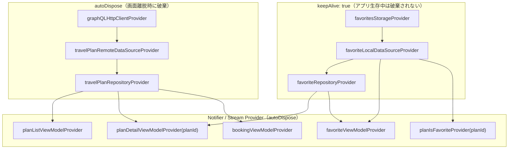

#### お気に入りのリアルタイム更新フロー

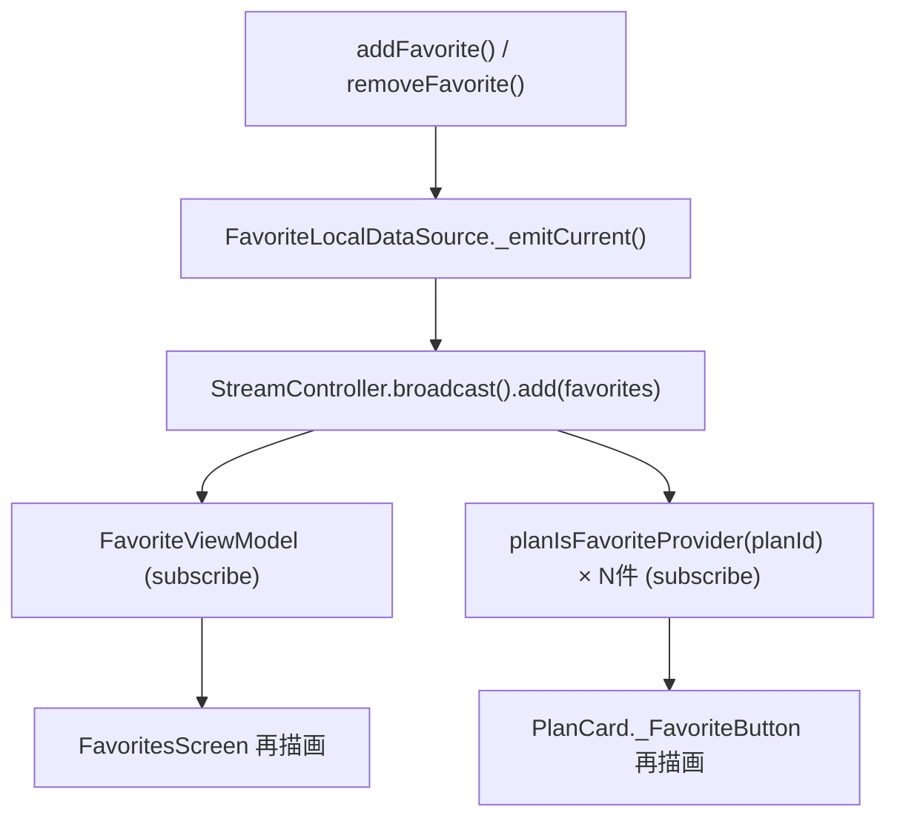

---

### 2-7. ナビゲーション（go_router 14.x）

`StatefulShellRoute.indexedStack` でボトムナビ 2 タブを実装しています。

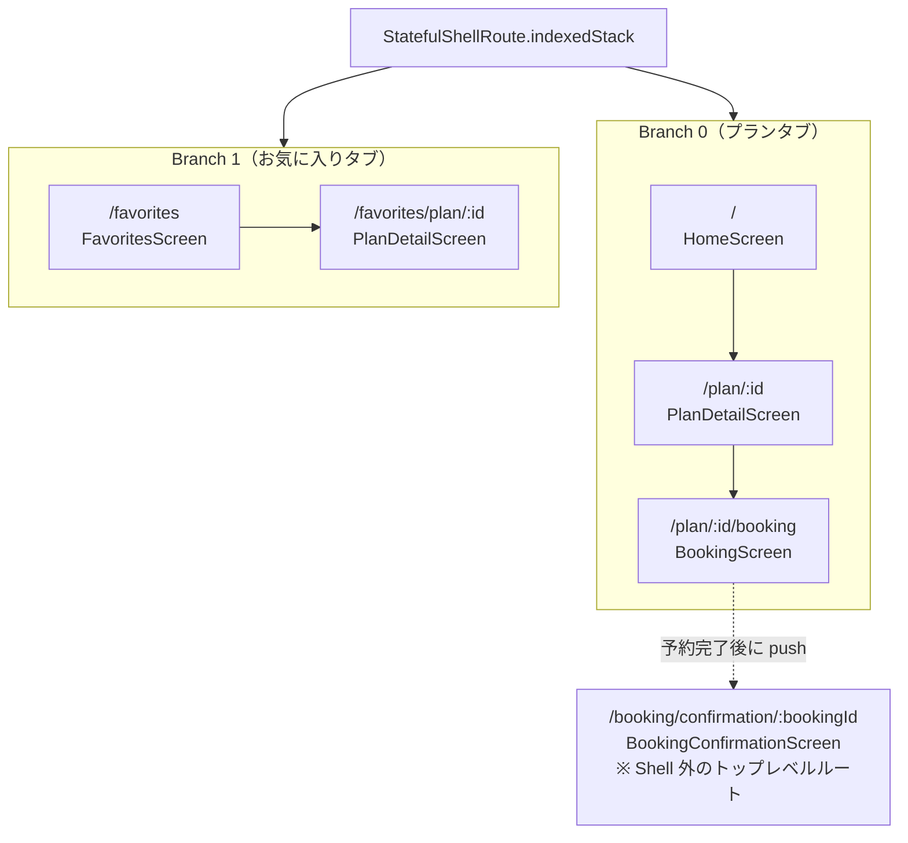

> **`indexedStack` の重要な挙動**
> 一度訪問したブランチのウィジェットツリーはタブ切り替え後も**破棄されません**。
> そのため `FavoriteViewModel` は初回訪問後、アプリ終了まで生存し続けます。

---

### 2-8. データフロー

#### プラン一覧取得（ページネーション付き）

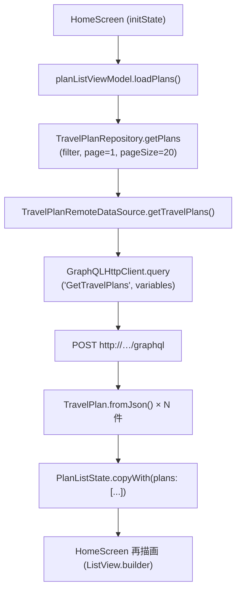

スクロールが末尾から 300px 以内になると `loadMore()` が呼ばれ、次ページのプランをリストに**追記**します。

#### お気に入り追加（プラン詳細から）

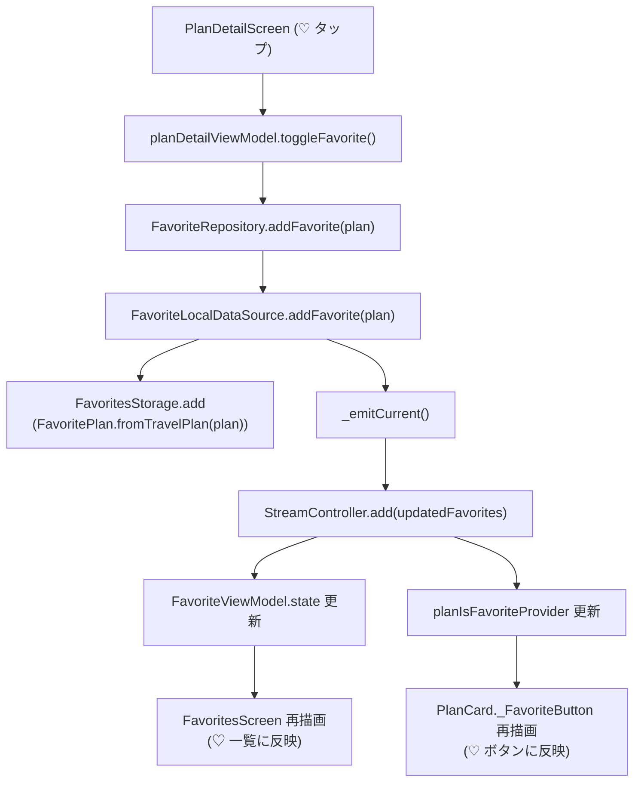

---

## 3. Backend アーキテクチャ

### 3-1. レイヤー構成

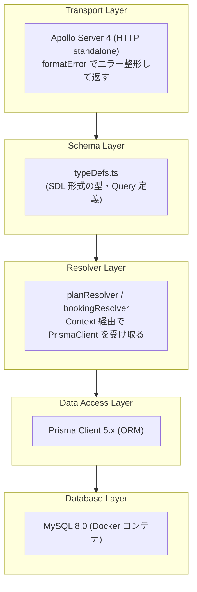

`PrismaClient` インスタンスは `index.ts` でシングルトンとして生成し、Apollo Context 経由で全 Resolver に注入します。

```typescript
export interface Context {
  prisma: PrismaClient;
}
context: async (): Promise<Context> => ({ prisma })
```

### 3-2. ディレクトリ構成

```
src/
├── index.ts                            # Apollo Server エントリポイント（port 4000）
└── graphql/
    ├── typeDefs.ts                     # GraphQL スキーマ定義（SDL）
    └── resolvers/
        ├── index.ts                    # planResolvers + bookingResolvers をマージ
        ├── planResolver.ts             # Query: travelPlans, travelPlan
        └── bookingResolver.ts          # Query: bookings, booking
                                        # Mutation: createBooking, cancelBooking
prisma/
├── schema.prisma                       # Prisma スキーマ（MySQL）
├── seed.ts                             # 初期データ投入スクリプト
└── migrations/                         # マイグレーション履歴
```

---

### 3-3. GraphQL スキーマ

#### Query

| フィールド | 引数 | 戻り値 | 用途 |
|---|---|---|---|
| `travelPlans` | `filter`, `page`, `pageSize` | `TravelPlansResult!` | プラン一覧（ページネーション・フィルター） |
| `travelPlan` | `id: ID!` | `TravelPlan` | プラン詳細 |
| `bookings` | `customerEmail` | `[Booking!]!` | 予約一覧（メール絞り込み任意） |
| `booking` | `id: ID!` | `Booking` | 予約詳細 |

#### Mutation

| フィールド | 引数 | 戻り値 | 用途 |
|---|---|---|---|
| `createBooking` | `input: CreateBookingInput!` | `BookingResult!` | 予約作成 |
| `cancelBooking` | `id: ID!` | `BookingResult!` | 予約キャンセル |

#### 主要な型

**`TravelPlansResult`** — ページネーション情報を含むラッパー型

```graphql
type TravelPlansResult {
  plans:       [TravelPlan!]!
  totalCount:  Int!
  hasNextPage: Boolean!
  currentPage: Int!
  totalPages:  Int!
}
```

**`BookingResult`** — 成功・失敗を HTTP 200 で統一して返す

```graphql
type BookingResult {
  success: Boolean!
  message: String!
  booking: Booking
}
```

**`PlanFilterInput`** — フィルター・ソート条件

| フィールド | 型 | 説明 |
|---|---|---|
| `keyword` | `String` | title / description / destination / country / tags に対する部分一致 |
| `category` | `String` | カテゴリ完全一致 |
| `region` | `String` | 地域完全一致 |
| `minPrice` / `maxPrice` | `Float` | 価格範囲 |
| `maxDuration` | `Int` | 最大日数 |
| `difficulty` | `String` | 難易度完全一致 |
| `sortBy` | `String` | `price` / `rating` / `duration` / `createdAt`（デフォルト: `rating`） |
| `sortOrder` | `String` | `asc` / `desc`（デフォルト: `desc`） |

#### `TravelPlan` のサーバー側算出フィールド

| フィールド | 算出方法 |
|---|---|
| `availableSpots` | `maxParticipants - currentBookings` |
| `effectivePrice` | `discountPrice ?? price` |
| `tags` | DB の JSON 文字列を `JSON.parse()` で `string[]` に変換 |
| 日付系フィールド | `Date` → ISO 8601 文字列（`toISOString()`） |

---

### 3-4. Resolver 設計

#### `planResolver.ts`

**`travelPlans`** — フィルタリングとページネーション

```
buildPlanWhereClause(filter)
  → keyword があれば OR 条件（title / description / destination / country / tags）
  → isAvailable: true を常に付加

buildOrderByClause(sortBy, sortOrder)
  → price / rating / durationDays / createdAt を指定可能

Promise.all([
  prisma.travelPlan.findMany({ where, orderBy, skip, take, include: PLAN_INCLUDE }),
  prisma.travelPlan.count({ where })
])
→ TravelPlansResult を返す
```

`PLAN_INCLUDE` でリレーション（images / highlights / itinerary.activities / reviews）を一括 Eager Load します。

**`travelPlan`** — 単一プランの詳細取得

`prisma.travelPlan.findUnique()` で同じ `PLAN_INCLUDE` を使って全リレーションを取得します。

#### `bookingResolver.ts`

**`createBooking`** — Prisma トランザクションで予約作成と空き枠更新をアトミックに実行

```
prisma.$transaction(async (tx) => {
  1. travelPlan.findUnique()      → プランの存在確認
  2. plan.isAvailable チェック    → 予約受付中かどうか確認
  3. availableSpots チェック      → 空き枠が足りるか確認
  4. booking.create()             → 予約レコード作成（status: 'CONFIRMED'）
  5. travelPlan.update()          → currentBookings をインクリメント
})
```

バリデーション（空文字・メール形式・参加人数）はリゾルバ内で実施し、エラー時は `success: false` の `BookingResult` を返すことで **HTTP 200 を維持**します。

**`cancelBooking`** — トランザクションでキャンセルと空き枠復元をアトミックに実行

```
prisma.$transaction(async (tx) => {
  1. booking.findUnique()          → 予約の存在確認
  2. status === 'CANCELLED' チェック → 二重キャンセル防止
  3. booking.update('CANCELLED')   → ステータス更新
  4. travelPlan.update()           → currentBookings をデクリメント
})
```

---

### 3-5. データベース設計（Prisma + MySQL）

#### ER 図

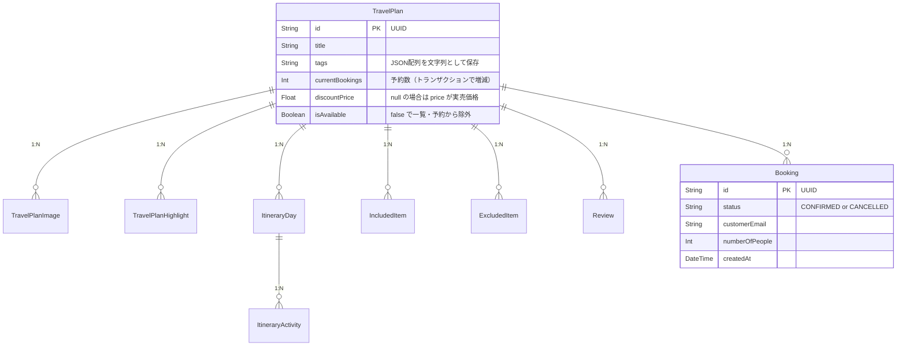

`TravelPlan` を親として、すべての子テーブルに `onDelete: Cascade` を設定（`Booking` を除く）。プラン削除時に関連データがすべて自動削除されます。

#### `Booking` のステータス遷移

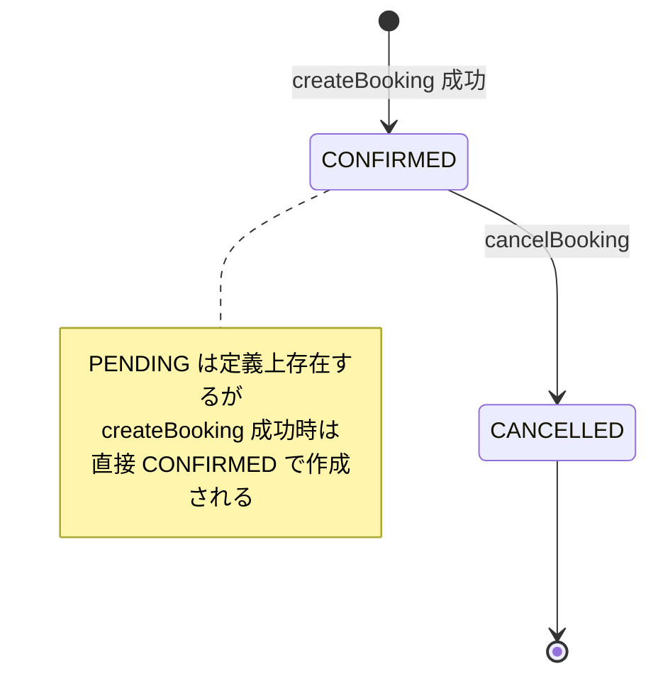

---

### 3-6. インフラ構成（Docker Compose）

| サービス | イメージ | ポート | 用途 |
|---|---|---|---|
| `mysql` | `mysql:8.0` | 3306 | データベース本体 |
| `backend`（任意） | ローカルビルド | 4000 | バックエンドサーバー |

バックエンド単体は `npm run dev`（ts-node + nodemon）でも起動でき、開発中はホットリロードが有効です。

---

## 4. Mobile ↔ Backend 通信設計

### 通信方式

HTTP POST に GraphQL リクエストを乗せる方式です。Apollo Client や graphql ライブラリは使用せず、`dart:io HttpClient` で直接実装しています。

### リクエスト / レスポンス形式

**リクエスト**
```json
{
  "query": "query GetTravelPlans($filter: PlanFilterInput, $page: Int, $pageSize: Int) { ... }",
  "variables": { "filter": { "keyword": "東京" }, "page": 1, "pageSize": 20 }
}
```

**正常レスポンス**
```json
{ "data": { "travelPlans": { "plans": [...], "totalCount": 42, ... } } }
```

**エラーレスポンス**
```json
{ "errors": [{ "message": "指定したプランが見つかりません", "extensions": { "code": "NOT_FOUND" } }] }
```

### エラーハンドリング

| 条件 | 処理 |
|---|---|
| HTTP ステータスが 200 以外 | `Exception('GraphQL request failed: {status}')` をスロー |
| レスポンスに `errors` フィールドあり | `errors[].message` を結合して `Exception` をスロー |
| ネットワーク接続不可 | `dart:io` の例外がそのまま伝播 |

例外は各 ViewModel の `catch` ブロックで捕捉され、`state.error` にセットされます。

### スキーマ変更時の更新順序

フィールドを 1 つ追加するだけで、以下のすべてのレイヤーに変更が必要です。

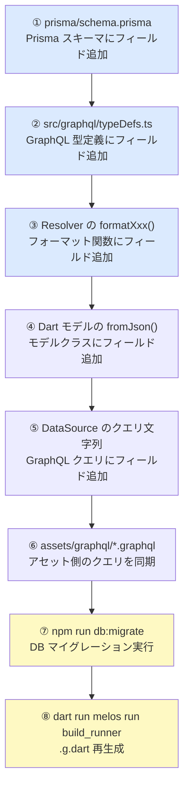

> **凡例**: 青 = Backend 変更、黄 = コマンド実行、白 = Mobile 変更

---

## 5. テスト戦略

### ViewModel テスト（test/viewmodels/）

```
test/viewmodels/
├── plan_list_viewmodel_test.dart        # PlanListViewModel
├── plan_list_viewmodel_test.mocks.dart  # 自動生成（@GenerateMocks）
├── plan_detail_viewmodel_test.dart
├── plan_detail_viewmodel_test.mocks.dart
├── booking_viewmodel_test.dart
├── booking_viewmodel_test.mocks.dart
├── favorite_viewmodel_test.dart
└── favorite_viewmodel_test.mocks.dart
```

### テストの基本構造

```dart
@GenerateMocks([TravelPlanRepository])
void main() {
  late MockTravelPlanRepository mockRepository;
  late ProviderContainer container;

  setUp(() {
    mockRepository = MockTravelPlanRepository();
    container = ProviderContainer(
      overrides: [
        travelPlanRepositoryProvider.overrideWithValue(mockRepository),
      ],
    );
  });

  tearDown(() => container.dispose());
}
```

`FavoriteViewModel` のテストは `MockFavoriteLocalDataSource` も override し、`StreamController` 経由でストリームを手動制御します。

### テストカバレッジの観点

| カテゴリ | 確認内容 |
|---|---|
| 初期状態 | `isLoading`, `plans / favorites` が期待する初期値であること |
| 成功時 | API / Stream から返ったデータが `state` に正しく反映されること |
| 失敗時 | 例外が `state.error` にセットされ `isLoading: false` になること |
| エッジケース | 空リスト・ページネーション境界値・バリデーションエラーの組み合わせ |

---

## 6. Widgetbook Preview 環境

### 概要

[Widgetbook 3.x](https://docs.widgetbook.io/) を使ったウィジェット Preview 環境です。  
GraphQL バックエンド・GoRouter・SharedPreferences に依存せず、ウィジェットのバリエーションをブラウザ上で確認できます。

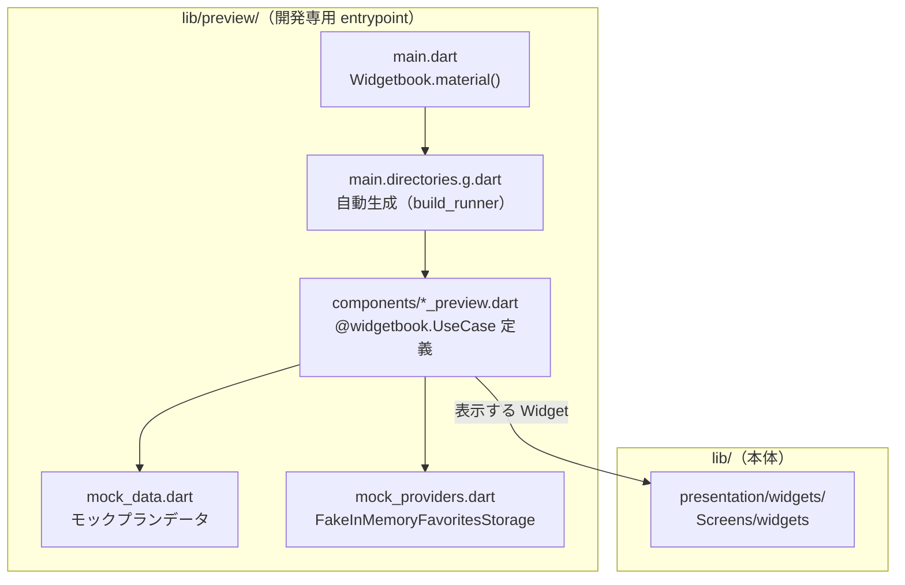

### モック戦略

`PlanCard` は `planIsFavoriteProvider` → `favoriteLocalDataSourceProvider` → `favoritesStorageProvider` のチェーンを持つ `ConsumerWidget` です。  
SharedPreferences を呼び出さない `FakeInMemoryFavoritesStorage` で `favoritesStorageProvider` をオーバーライドすることで、チェーン全体が自動的にモックに切り替わります。

```dart
// mock_providers.dart
final previewProviderOverrides = [
  favoritesStorageProvider.overrideWith(
    (ref) => FakeInMemoryFavoritesStorage(),
  ),
];

// components/plan_card_preview.dart
@widgetbook.UseCase(name: '通常プラン（お気に入りなし）', type: PlanCard)
Widget buildPlanCardDefault(BuildContext context) {
  return ProviderScope(
    overrides: previewProviderOverrides,
    child: PlanCard(plan: mockPlanTokyo),
  );
}
```

### アドオン構成

| アドオン | 機能 |
|---|---|
| `MaterialThemeAddon` | `AppTheme.lightTheme`（本番と同じテーマ） |
| `ViewportAddon` | iPhone 13 / Samsung Galaxy A50 |
| `TextScaleAddon` | 0.85〜2.0 倍（アクセシビリティ確認） |
| `LocalizationAddon` | ja_JP |

### 起動コマンド

```bash
dart run melos run "preview:web"   # Chrome（推奨：サイズ調整しやすい）
dart run melos run preview         # デフォルトデバイス
```

### 新しい UseCase の追加手順

1. `lib/preview/components/xxx_preview.dart` を作成
2. `@widgetbook.UseCase(name: '...', type: TargetWidget)` アノテーションを付与
3. `dart run melos run build_runner` で `main.directories.g.dart` を再生成
4. `dart run melos run "preview:web"` で動作確認
