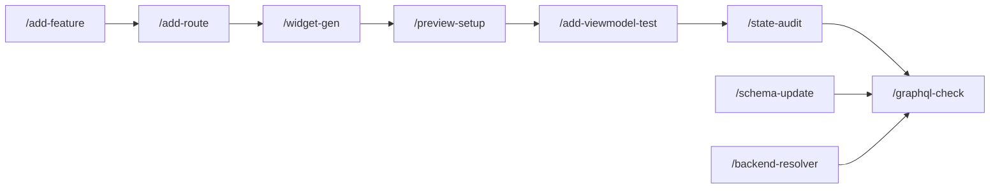

# Claude Code スキル活用ガイド — travel_booking

このプロジェクトには 20 個のカスタムスキルが定義されています。
Claude Code のチャット欄でスキル名を呼びかけるだけで自動起動するものと、
`/スキル名 [引数]` と明示的に呼び出すものがあります。

---

## スキル一覧早見表

| スキル名 | 起動方法 | 概要 | 自動起動 |
|---|---|---|:---:|
| `flutter-gen` | `/flutter-gen` または自然文 | Riverpod `.g.dart` コード生成 | ✓ |
| `backend-up` | `/backend-up` のみ | Docker バックエンド環境起動 | — |
| `db-reset` | `/db-reset` のみ | 開発用 DB 初期化（要確認） | — |
| `fix-endpoint` | `/fix-endpoint [IP]` のみ | GraphQL 接続先変更 | — |
| `graphql-check` | `/graphql-check` または自然文 | バックエンドとモバイルの GraphQL 整合性確認 | ✓ |
| `add-feature` | `/add-feature <機能名>` または自然文 | MVVM+Repository 雛形ファイル一括生成 | — |
| `add-route` | `/add-route <path> <Screen>` または自然文 | GoRoute 追加・ボトムナビ更新 | ✓ |
| `backend-resolver` | `/backend-resolver <EntityName>` または自然文 | GraphQL Resolver と typeDefs を同時生成 | ✓ |
| `schema-update` | `/schema-update <変更内容>` または自然文 | DB〜Dart 全レイヤースキーマ変更 | ✓ |
| `bug-trace` | `/bug-trace <エラー>` または自然文 | バグ原因特定と修正 | ✓ |
| `add-viewmodel-test` | `/add-viewmodel-test <名前>` または自然文 | ViewModel テスト追加 | ✓ |
| `add-mock-data` | `/add-mock-data <条件>` または自然文 | 条件付きテストデータ DB 投入 | ✓ |
| `state-audit` | `/state-audit <名前>` または自然文 | 状態管理の問題チェック（独立実行） | ✓ |
| `perf-audit` | `/perf-audit <名前>` または自然文 | パフォーマンス問題の静的監査（独立実行） | ✓ |
| `widget-gen` | `/widget-gen <名前>` または自然文 | 共通ウィジェット雛形生成 | ✓ |
| `preview-setup` | `/preview-setup [--init] [<名前>]` または自然文 | Widgetbook Preview 初期化・ケース追加 | ✓ |
| `add-widget-test` | `/add-widget-test <名前> [--with-callback] [--with-error]` または自然文 | Widget テスト自動生成（add-viewmodel-test の姉妹スキル） | ✓ |
| `refactor-screen` | `/refactor-screen <Screen名> [--wizard] [--extract-widgets] [--split <数>]` または自然文 | 既存 Screen を構造的にリファクタ（分割・ウィザード化・ウィジェット抽出） | ✓ |
| `test-fix` | `/test-fix [--flutter\|--backend\|--all]` または自然文 | 壊れたテストを自動検出・修復（context: fork で独立実行） | ✓ |
| `doc-sync` | `/doc-sync [--check\|--fix\|--readme\|--skills\|--arch]` または自然文 | ドキュメント更新漏れを検出・修復（8種類 diff タイプ、context: fork で独立実行） | ✓ |

> **自動起動 ✓**: 関連する自然な文章でも Claude が自動的にスキルを起動します。  
> **自動起動 —**: `disable-model-invocation: true` のため `/コマンド` での明示呼び出しが必要です。

### スキル連携フロー



機能追加の典型フロー（左→右）と、スキーマ変更・バックエンド追加後の整合性確認（→ `/graphql-check`）を示します。

---

## スキルファイルの構成

各スキルは `.claude/skills/スキル名/` ディレクトリ内に格納されています。

```
.claude/skills/
├── flutter-gen/
│   └── SKILL.md
├── backend-up/
│   └── SKILL.md
├── db-reset/
│   └── SKILL.md
├── fix-endpoint/
│   ├── SKILL.md
│   └── references/
│       └── platform-guide.md       # 環境別設定・dart-define ガイド
├── graphql-check/
│   ├── SKILL.md
│   └── references/
│       └── check-targets.md        # チェック対象ファイル一覧
├── add-feature/
│   ├── SKILL.md
│   └── references/
│       └── mvvm-pattern.md         # MVVM パターン・テンプレートコード
├── add-route/
│   ├── SKILL.md
│   └── references/
│       └── route-template.md       # GoRoute テンプレートコード
├── backend-resolver/
│   ├── SKILL.md
│   └── references/
│       └── resolver-template.md    # typeDefs・Resolver テンプレートコード
├── schema-update/
│   ├── SKILL.md
│   └── references/
│       └── layer-guide.md          # レイヤー別変更ルール・コード例
├── bug-trace/
│   ├── SKILL.md
│   └── references/
│       └── error-patterns.md       # エラーパターン辞書（7系統）
├── add-viewmodel-test/
│   ├── SKILL.md
│   └── references/
│       └── test-pattern.md         # テストコードテンプレート集
├── add-mock-data/
│   ├── SKILL.md
│   └── references/
│       └── data-patterns.md        # 条件別データパターン（soldOut / discounted 等）
├── state-audit/
│   ├── SKILL.md
│   └── references/
│       └── checklist.md            # 監査チェックリスト・コード例
├── perf-audit/
│   ├── SKILL.md
│   └── references/
│       ├── perf-checklist.md       # 4観点チェックリスト・Bad/Good コード例
│       └── report-template.md      # レポート出力フォーマット
├── widget-gen/
│   ├── SKILL.md
│   └── references/
│       └── widget-template.md      # StatelessWidget / StatefulWidget テンプレート
├── preview-setup/
│   ├── SKILL.md
│   └── references/
│       ├── preview-structure.md    # mock_providers / mock_data / main.dart ボイラープレート
│       └── preview-case-template.md # Screen 4シナリオ・Widget ケーステンプレート
├── add-widget-test/
│   ├── SKILL.md
│   └── references/
│       └── widget-test-template.md # 4種テンプレート（基本/コールバック/sealed class/ガード処理）
├── refactor-screen/
│   ├── SKILL.md
│   └── references/
│       └── refactor-patterns.md    # wizard / extract-widgets / split パターンコード例
├── test-fix/
│   ├── SKILL.md
│   └── references/
│       └── error-fix-patterns.md   # 5カテゴリのエラーパターンと修正手順
└── doc-sync/
    ├── SKILL.md
    └── references/
        └── sync-rules.md           # ドキュメント↔ソースのマッピング定義・8種類の差分タイプ
```

---

## SKILL.md の frontmatter 設計について

各 SKILL.md は以下の frontmatter で動作を制御しています。

```yaml
---
name: スキル名
description: |
  # Claudeが「いつ使うか」を判断する記述
  # 具体的な自然文トリガーを含める
argument-hint: "引数の説明（タブ補完に表示）"
allowed-tools:        # このスキル実行時に自動許可するツール
  - Read
  - Edit
  - Bash
disable-model-invocation: true   # 手動実行専用（破壊的操作に設定）
context: fork                    # 独立実行（本会話コンテキストを汚さない）
metadata:
  version: "1.0.0"
---
```

| frontmatter | 使用スキル | 理由 |
|---|---|---|
| `disable-model-invocation: true` | `backend-up`・`db-reset`・`fix-endpoint` | 副作用・破壊的操作のため手動専用 |
| `context: fork` | `graphql-check`・`state-audit`・`perf-audit` | 読み取り専用の分析タスクで本会話を汚さない |

---

## スキル別詳細

---

### flutter-gen — Riverpod コード生成

#### 概要
`dart run melos run build_runner` を実行して `@riverpod` アノテーション付きクラスの `.g.dart` ファイルを再生成します。

#### 起動方法
```
/flutter-gen
```
または以下の自然文で自動起動：
- 「コード生成して」
- 「build_runner を実行して」
- 「Provider が見つからない」
- 「getter 'xxxProvider' isn't defined」

#### 実行内容
1. `@riverpod` 付きファイルを確認
2. `dart run melos run build_runner` を実行
3. 生成・更新された `.g.dart` ファイルを一覧表示
4. エラーがあれば原因と修正方法を日本語で説明

#### こんな時に使う
- ViewModel を新規作成・変更したとき
- `The getter 'xxxProvider' isn't defined` エラーが出たとき
- `add-feature` や `add-viewmodel-test` の実行後

---

### backend-up — バックエンド環境起動

#### 概要
Docker Compose で MySQL + Apollo GraphQL サーバーをバックグラウンド起動します。
副作用があるため **`/backend-up` の明示呼び出しが必要** です。

#### 起動方法
```
/backend-up
```

#### 実行内容
1. Docker Desktop の起動確認
2. `docker compose up -d` を実行
3. `docker compose ps` でコンテナ状態を確認
4. MySQL の `healthy` ステータスを確認
5. `http://localhost:4000/graphql` の疎通確認

#### こんな時に使う
- 朝の開発開始時
- `Connection refused` エラーが出たとき
- Docker コンテナの状態を確認したいとき

#### 注意点
- Docker Desktop が起動済みであることが前提
- ポート 3306（MySQL）・4000（GraphQL）が空いている必要あり

---

### db-reset — 開発用 DB 初期化

#### 概要
`travel_booking` データベースを完全リセットしてシードデータを再投入します。
**全データが削除**されるため、実行前に確認プロンプトが表示されます。
**`/db-reset` の明示呼び出しが必要**です。

#### 起動方法
```
/db-reset
```

#### 実行内容
1. ユーザー確認プロンプト
2. Docker 起動確認（未起動なら `backend-up` を案内）
3. `npm run db:reset`（Prisma migrate reset --force）
4. `npm run db:seed`（シードデータ投入）
5. 投入データ件数を報告

#### こんな時に使う
- テストデータが壊れてクリーンにしたいとき
- スキーマ変更後にデータを作り直したいとき

> **警告**: 開発環境専用です。本番では `npm run db:migrate:prod` を使用してください。

---

### fix-endpoint — GraphQL エンドポイント設定

#### 概要
`graphql_config.dart` の `_baseUrl` を確認・変更します。PC の IP アドレスが変わった時や
実機テストに切り替えるときに使います。設定ファイルを変更するため **`/fix-endpoint` の明示呼び出しが必要** です。

#### 起動方法
```
/fix-endpoint                    # 現在の設定確認と選択肢の提示
/fix-endpoint 192.168.1.50      # 直接変更
/fix-endpoint localhost          # localhost に変更
```

#### 実行内容（引数あり）
1. 現在の `_baseUrl` を表示
2. 指定アドレスに変更（ポート `4000/graphql` は維持）
3. 変更後の URL を確認

#### 実行内容（引数なし）
1. 現在の設定を表示
2. 環境別の推奨設定を提示

| 環境 | 推奨値 |
|---|---|
| iOS シミュレーター | `http://localhost:4000/graphql` |
| Android エミュレーター | `http://10.0.2.2:4000/graphql` |
| 実機（LAN） | `http://<ホストPCのIP>:4000/graphql` |

3. `--dart-define` を使った環境変数化への移行も提案
（詳細: `.claude/skills/fix-endpoint/references/platform-guide.md`）

#### こんな時に使う
- Wi-Fi 環境が変わって PC の IP が変わったとき
- シミュレーター ↔ 実機を切り替えるとき
- `SocketException: Connection refused` が出たとき

---

### graphql-check — GraphQL 整合性チェック

#### 概要
バックエンドの `typeDefs.ts` とモバイルのクエリ文字列を比較し、
フィールド不足・型不一致・未使用フィールドを検出します。
独立実行（`context: fork`）で本会話のコンテキストを汚しません。

#### 起動方法
```
/graphql-check
```
または以下の自然文で自動起動：
- 「GraphQL の整合性を確認して」
- 「スキーマが合っているか確認して」
- 「フィールドが見つからないエラーが出る」

#### チェック内容
- モバイルが要求するフィールドがバックエンドスキーマに存在するか
- Query/Mutation 名が typeDefs と一致しているか
- 変数の型（`$id: ID!` 等）が一致しているか
- バックエンドに定義済みだがモバイルで未取得のフィールド

（チェック対象ファイル詳細: `.claude/skills/graphql-check/references/check-targets.md`）

#### こんな時に使う
- スキーマ変更（`schema-update`）の後
- GraphQL エラーが出てどこが原因か分からないとき
- スキーマレビュー前の自己チェックとして

---

### add-feature — MVVM 機能スキャフォールド

#### 概要
指定した機能名で MVVM + Repository パターンの雛形ファイル 6 つを一括生成します。
生成後に `build_runner` まで自動実行します。

#### 起動方法
```
/add-feature hotel_search
/add-feature review_submission
/add-feature user_profile
```

#### 生成ファイル（例: `hotel_search`）

```
lib/data/
├── models/hotel_search_model.dart
├── datasources/remote/hotel_search_remote_datasource.dart
└── repositories/
    ├── hotel_search_repository.dart          # インターフェース
    └── hotel_search_repository_impl.dart    # 実装
lib/presentation/
├── viewmodels/hotel_search_viewmodel.dart
└── screens/hotel_search/hotel_search_screen.dart
```

（MVVM パターン詳細・テンプレートコード: `.claude/skills/add-feature/references/mvvm-pattern.md`）

#### こんな時に使う
- 全く新しい画面・機能を追加するとき
- アーキテクチャパターンを統一したいとき

---

### add-route — GoRoute 追加

#### 概要
`app_router.dart` に GoRoute を追加し、必要に応じてボトムナビの
`StatefulShellBranch` も更新します。`add-feature` の直後に使うことが多いです。

#### 起動方法
```
/add-route /booking-history BookingHistoryScreen
/add-route /plan/:id/review ReviewScreen
/add-route /notifications NotificationsScreen --tab
```
または以下の自然文で自動起動：
- 「ルートを追加して」
- 「画面をルーティングに登録して」
- 「GoRouter に追加して」
- 「ボトムナビに新しいタブを追加して」

#### 動作モード

| モード | 説明 |
|---|---|
| 通常ルート（`--tab` なし） | 既存ブランチにネスト or トップレベルに追加 |
| タブルート（`--tab`） | `StatefulShellBranch` + `BottomNavigationBarItem` を同時追加 |

#### 実行内容
1. 現在の `app_router.dart` を Read して重複チェック
2. 対象 Screen ファイルの存在確認（なければ `/add-feature` を案内して中断）
3. パス構造に応じたネスト位置を判断して GoRoute を追加
4. `--tab` の場合は Branch と BottomNavigationBarItem も追加
5. `dart analyze` で構文エラーを確認

（GoRoute テンプレートコード: `.claude/skills/add-route/references/route-template.md`）

#### こんな時に使う
- `add-feature` で新機能を作った後に画面遷移を登録するとき
- ボトムナビにタブを増やしたいとき

---

### backend-resolver — GraphQL Resolver & typeDefs 生成

#### 概要
TypeScript の GraphQL Resolver と `typeDefs.ts` エントリを同時生成します。
`schema-update`（DB〜Dart 全 8 ステップ）の「バックエンド TypeScript だけ」軽量版です。
DB マイグレーションも Flutter 側も変更しないため、API の追加・拡張に素早く対応できます。

#### 起動方法
```
/backend-resolver UserReview --query
/backend-resolver TravelTag --both
/backend-resolver Notification --mutation
```
または以下の自然文で自動起動：
- 「Resolver を追加して」
- 「バックエンドに新しいクエリを追加して」
- 「GraphQL の Mutation を追加したい」
- 「typeDefs にエンドポイントを追加して」
- 「バックエンドだけ変更したい」

#### オプション

| オプション | 説明 |
|---|---|
| `--query`（デフォルト） | 一覧 + 単体の Query のみ生成 |
| `--mutation` | Mutation のみ生成 |
| `--both` | Query と Mutation を両方生成 |

#### 実行ステップ

| ステップ | 内容 |
|---|---|
| Step 1 | `schema.prisma` でエンティティの存在確認 |
| Step 2 | `typeDefs.ts` に Query / Mutation / Input / Payload を追記 |
| Step 3 | Resolver ファイルを生成または更新し `resolvers/index.ts` に追記 |
| Step 4 | `tsc --noEmit` で TypeScript ビルド確認 |
| Step 5 | curl で追加した Query / Mutation の動作確認 |

#### `schema-update` との使い分け

| やりたいこと | 使うスキル |
|---|---|
| バックエンド TS のみ変更（DB・Flutter は触らない） | `/backend-resolver` |
| DB スキーマ変更〜Flutter まで全レイヤー反映 | `/schema-update` |

（Resolver テンプレートコード: `.claude/skills/backend-resolver/references/resolver-template.md`）

#### こんな時に使う
- 既存モデルに新しいクエリ条件を追加したいとき
- 管理操作用の Mutation を追加したいとき
- Flutter 側の変更は不要で API だけ先に実装するとき

---

### schema-update — 全レイヤースキーマ変更

#### 概要
`schema.prisma` の変更を DB から Dart まで全 8 ステップにわたって反映します。
1 フィールドの追加でも 7 ファイル以上が対象になるため、ガイドに従って漏れなく変更します。

#### 起動方法
```
/schema-update TravelPlanにratingCountフィールドを追加
/schema-update BookingにpaidAt(nullable DateTime)を追加
```
または「フィールドを追加したい」「スキーマを変更したい」などの自然文で自動起動。

#### 実行ステップ

| ステップ | 対象 | 内容 |
|---|---|---|
| Step 1 | `prisma/schema.prisma` | フィールド追加 |
| Step 2 | `src/graphql/typeDefs.ts` | GraphQL スキーマ更新 |
| Step 3 | `src/graphql/resolvers/` | Resolver 更新 |
| Step 4 | `lib/data/models/xxx.dart` | Dart モデル更新 |
| Step 5 | `remote_datasource.dart` | クエリ文字列更新 |
| Step 6 | `npm run db:migrate` | DB マイグレーション |
| Step 7 | `dart run melos run build_runner` | コード再生成 |
| Step 8 | 解析・テスト | 動作確認 |

（レイヤー別変更ルール・コード例: `.claude/skills/schema-update/references/layer-guide.md`）

---

### bug-trace — バグ原因特定と修正

#### 概要
エラーメッセージやスタックトレースを受け取り、このプロジェクト固有の 7 系統のエラーパターンと照合して原因を特定・修正します。

#### 起動方法
```
/bug-trace The getter 'planListViewModelProvider' isn't defined
/bug-trace Exception: GraphQL request failed: 400
/bug-trace Null check operator used on a null value
```
または「エラーが出た」「バグを直して」「クラッシュする」などの自然文で自動起動。

#### 対応エラー種別

| 種別 | 代表的なエラー |
|---|---|
| Riverpod / コード生成 | `getter 'xxxProvider' isn't defined`・`ProviderNotFoundException` |
| GraphQL 通信 | `GraphQL request failed: 4xx/5xx`・`Connection refused` |
| JSON パース | `Null check operator`・`type 'Null' is not a subtype of type` |
| Navigation | `GoException: No routes for location` |
| State 管理 | 無限ローディング・状態が更新されない |
| preview-setup（Widgetbook） | `No WidgetbookApp found`・`GoException: no routes for location`（Preview 内） |
| backend-resolver（TypeScript / GraphQL） | `Type 'XXX' is not assignable to type 'Resolver'`・`Transaction API error` |

（エラーパターン辞書: `.claude/skills/bug-trace/references/error-patterns.md`）

---

### add-viewmodel-test — ViewModel テスト追加

#### 概要
指定した ViewModel のユニットテストを `Mockito + ProviderContainer` パターンで追加・拡充します。
未テストのメソッドを自動検出して成功/失敗/エッジケースを網羅します。

#### 起動方法
```
/add-viewmodel-test booking
/add-viewmodel-test favorite
/add-viewmodel-test plan_list
```
または「テストを追加して」「〜のテストを書いて」などの自然文で自動起動。

#### 既存テストファイルとの対応

| 引数 | 既存テストファイル |
|---|---|
| `plan_list` | あり → 未テストメソッドを追加 |
| `plan_detail` | あり → 未テストメソッドを追加 |
| `booking` | あり → 未テストメソッドを追加 |
| `favorite` | あり → 未テストメソッドを追加 |
| `booking_history` | あり → 未テストメソッドを追加 |
| 新規機能名 | なし → テンプレートから新規作成 |

（テストコードテンプレート: `.claude/skills/add-viewmodel-test/references/test-pattern.md`）

---

### add-mock-data — 条件付きテストデータ投入

#### 概要
`prisma/seed.ts` のパターンに従い、指定した条件のテストデータを DB に追加投入します。
`db-reset` で全削除せずにピンポイントでデータを足せます。

#### 起動方法
```
/add-mock-data travelPlan 3 --condition soldOut
/add-mock-data travelPlan 5 --condition discounted
/add-mock-data travelPlan 2 --condition highRating
```
または以下の自然文で自動起動：
- 「満席プランのテストデータが欲しい」
- 「割引中のプランを何件か追加して」
- 「特定条件のシードデータを作りたい」

#### 使用可能な条件値

| 条件値 | 内容 |
|---|---|
| `soldOut` | 満席（`maxParticipants === currentBookings` かつ `isAvailable: true`） |
| `discounted` | 割引中（`discountPrice` が `price` の 70% 以下） |
| `unavailable` | 募集停止（`isAvailable: false`） |
| `highRating` | 高評価（`rating` が 4.5 以上） |
| 条件なし | 通常プラン |

#### 実行内容
1. `schema.prisma` と `seed.ts` を Read してフィールド構成を確認
2. 条件に応じたデータパターンを選択
3. Docker 起動確認（未起動なら `/backend-up` を案内）
4. `docker compose exec` 経由で Prisma Client を使ってデータを投入
5. GraphQL で `totalCount` を取得して結果レポートを出力

（データパターン詳細: `.claude/skills/add-mock-data/references/data-patterns.md`）

#### こんな時に使う
- 満席・割引などの特定状態を UI で確認したいとき
- `db-reset` せずに追加でデータを足したいとき

---

### state-audit — 状態管理監査

#### 概要
指定した ViewModel を 5 つの観点で監査し、問題を重大度付きで報告します。
独立実行（`context: fork`）で本会話のコンテキストを汚しません。

#### 起動方法
```
/state-audit booking
/state-audit home
/state-audit plan_detail
```
または「状態管理を確認して」「ViewModel をレビューして」などの自然文で自動起動。

#### チェック観点

| 観点 | 主な確認内容 |
|---|---|
| 三態管理 | loading/error/success の各パスで isLoading と error が正しいか |
| 二重実行防止 | ガード句（`if (state.isLoading) return`）があるか |
| リソースリーク | `StreamSubscription`・`GraphQLHttpClient` が `onDispose` で解放されているか |
| copyWith の一貫性 | `clearError: true` フラグが一貫して使われているか |
| Provider 配置 | `ref.watch` と `ref.read` の使い分けが正しいか |

（監査チェックリスト・コード例: `.claude/skills/state-audit/references/checklist.md`）

---

### perf-audit — パフォーマンス静的監査

#### 概要
指定した ViewModel または画面を 4 つの観点でパフォーマンス静的解析し、問題を重大度付きでレポートします。`state-audit` の姉妹スキルでパフォーマンス領域を担当します。
独立実行（`context: fork`）で本会話のコンテキストを汚しません。

#### 起動方法
```
/perf-audit home
/perf-audit plan_list
/perf-audit booking
```
または以下の自然文で自動起動：
- 「パフォーマンスをチェックして」
- 「不要な rebuild が起きていないか確認して」
- 「keepAlive の設定が正しいか見て」
- 「GraphQL の呼び出しが多すぎる気がする」

#### チェック観点

| 観点 | 主な確認内容 |
|---|---|
| keepAlive / autoDispose の設計 | StreamController を持つ Provider に `keepAlive: true` が設定されているか |
| 不要な rebuild の検出 | `ref.watch` のスコープが広すぎないか・`select()` で絞れないか |
| GraphQL クエリの効率 | リスト画面で detail 専用フィールドを過剰取得していないか |
| リソースリーク | `ScrollController`・`StreamSubscription` が `dispose()` で解放されているか |

#### state-audit との役割分担

| スキル | 担当領域 |
|---|---|
| `state-audit` | 三態管理・二重実行防止・copyWith 一貫性・Provider の ref 使い分け |
| `perf-audit` | rebuild 最小化・keepAlive 設計・GraphQL 効率・リソースリーク |

（チェックリスト詳細: `.claude/skills/perf-audit/references/perf-checklist.md`）  
（レポートフォーマット: `.claude/skills/perf-audit/references/report-template.md`）

---

### widget-gen — 共通ウィジェット雛形生成

#### 概要
`lib/presentation/widgets/` に既存 3 ウィジェット（`rating_stars`・`loading_indicator`・`app_error_widget`）のコーディング規約に準拠した雛形を生成します。
`--test` フラグで `testWidgets` ベースのテストファイルも同時生成できます。

#### 起動方法
```
/widget-gen price_badge
/widget-gen empty_state --stateful
/widget-gen favorite_button --stateful --test
```
または以下の自然文で自動起動：
- 「共通ウィジェットを追加したい」
- 「新しいウィジェットを作って」
- 「〜のウィジェットコンポーネントを生成して」
- 「StatefulWidget の雛形が欲しい」

#### オプション

| オプション | 説明 |
|---|---|
| `--stateful` | `StatefulWidget` を生成（省略時は `StatelessWidget`） |
| `--test` | `test/widgets/<name>_test.dart` も同時生成 |

#### 規約（既存ウィジェットから自動参照）
- 色は `AppTheme.xxxColor` 定数のみ使用（ハードコード禁止）
- `const` コンストラクタ + `super.key`
- `@riverpod` / `ConsumerWidget` は生成しない（ViewModel 連携が必要なら `/add-feature` を案内）

#### 実行内容
1. 既存 3 ウィジェットと `app_theme.dart` を Read して規約を確認
2. 重複チェック（同名ファイルがあれば警告して中断）
3. ウィジェットファイルを生成
4. `--test` 指定時はテストファイルも生成
5. `dart analyze` で構文エラーを確認

（テンプレートコード: `.claude/skills/widget-gen/references/widget-template.md`）

---

### add-widget-test — Widget テスト自動生成

#### 概要
指定した Widget の `testWidgets` ベースのテストを自動生成します。
`add-viewmodel-test`（ViewModel 単体テスト）の姉妹スキルで、UI 表示・インタラクションを担当します。

#### 起動方法
```
/add-widget-test RatingStars
/add-widget-test AppErrorWidget --with-error
/add-widget-test BookingStepIndicator --with-callback
```
または「Widget テストを追加して」「ウィジェットのテストを書いて」などの自然文で自動起動。

#### オプション

| オプション | 説明 |
|---|---|
| `--with-callback` | `onTap` / `onRetry` 等コールバック prop のテストを重点的に生成 |
| `--with-error` | `AppError` sealed class の型分岐テストを生成 |

#### 実行内容
1. 対象 Widget ファイルを Read して props・条件分岐・コールバックを把握
2. `test/widgets/` の既存テストを確認（あれば不足ケースを追記）
3. `references/widget-test-template.md` のパターンでテストファイルを生成
4. `dart run melos run test` で全件パスを確認

#### 注意点
- `ConsumerWidget`（Riverpod 依存）はこのスキルの対象外（`ProviderScope` + mock の手動設定が必要）
- Flutter 3.22+ では `ElevatedButton.icon()` は `find.byType(ElevatedButton)` でヒットしない → `find.text('ラベル')` を使う

（テンプレートコード: `.claude/skills/add-widget-test/references/widget-test-template.md`）

---

### refactor-screen — 既存 Screen 構造的リファクタ

#### 概要
既存の Screen ファイルを 3 モードで構造的にリファクタします。
内部ロジックは変えず、UI 構造のみを整理します。

#### 起動方法
```
/refactor-screen BookingScreen --wizard
/refactor-screen PlanDetailScreen --extract-widgets
/refactor-screen HomeScreen --split 3
```
または「画面をウィザード形式にして」「ウィジェットを分割して」などの自然文で自動起動。

#### モード

| モード | 説明 |
|---|---|
| `--wizard` | PageView + ステップ管理で多段フォームに変換 |
| `--extract-widgets` | プライベートメソッドをウィジェットクラスに抽出 |
| `--split <N>` | 画面を N 個の Widget/Screen に分割 |

#### 実行内容
1. 対象 Screen と関連 ViewModel を Read して構造を把握
2. **ユーザーに変更方針を確認**してから実施
3. `references/refactor-patterns.md` のパターンで修正を適用
4. `dart analyze` で構文エラーを確認

#### 注意点
- `app_router.dart` は変更しない（ルーティング変更が必要なら `/add-route` を案内）
- `--wizard` は Step の数・フィールド配置はユーザー確認後に決定

（パターンコード: `.claude/skills/refactor-screen/references/refactor-patterns.md`）

---

### doc-sync — ドキュメント更新漏れ検出・修復

#### 概要
ソースコードとドキュメントの差分を 8 種類の diff タイプに分類して検出・修復します。
独立実行（`context: fork`）で本会話のコンテキストを汚しません。
`--check` で検出のみ、`--fix` で修復まで実行します。

#### 起動方法
```
/doc-sync --check
/doc-sync --fix
/doc-sync --readme
/doc-sync --skills
/doc-sync --arch
```
または「ドキュメントが古い」「doc を同期して」「README を最新にして」「アーキテクチャドキュメントを更新して」などの自然文で自動起動。

#### オプション

| オプション | 対象 |
|---|---|
| `--check`（省略時デフォルト） | 全ドキュメント（検出のみ） |
| `--fix` | 全ドキュメント（検出 + 修復） |
| `--readme` | README.md のみ |
| `--skills` | skill_guidance.md + CLAUDE.md のみ |
| `--arch` | architecture_guidance.md のみ |

#### 対応 diff タイプ

| タイプ | 検出内容 |
|---|---|
| SKILL_COUNT | スキルディレクトリ数 ≠ skill_guidance.md テーブル行数 |
| SKILL_MISSING | .claude/skills/ に存在するがドキュメントに未記載 |
| SKILL_DETAIL | skill_guidance.md の ### セクションが SKILL.md と乖離 |
| ROUTE_OUTDATED | app_router.dart の GoRoute と mermaid が不一致 |
| SCREEN_MISSING | lib/presentation/screens/ にあるが一覧に未記載 |
| TEST_MISSING | test/ の *_test.dart がテスト一覧に未記載 |
| PROVIDER_OUTDATED | plan_list_viewmodel.dart の Provider 定義が一覧と不一致 |
| SEED_OUTDATED | prisma/seed.ts の変更が README のシードデータ一覧に未反映 |

（マッピングルール詳細: `.claude/skills/doc-sync/references/sync-rules.md`）

---

### test-fix — 壊れたテスト自動検出・修復

#### 概要
テストを自動実行して失敗を検出し、プロジェクト固有の 5 カテゴリのエラーパターンと照合して自動修復します。
独立実行（`context: fork`）で本会話のコンテキストを汚しません。

#### 起動方法
```
/test-fix --flutter
/test-fix --backend
/test-fix --all
```
または「テストが壊れた」「CIが落ちている」「テストエラーを直して」などの自然文で自動起動。

#### オプション

| オプション | 対象 |
|---|---|
| `--flutter`（省略時デフォルト） | Flutter ViewModel テスト + Widget テスト |
| `--backend` | Node.js / Jest テスト |
| `--all` | Flutter + Backend 両方 |

#### 対応エラーカテゴリ

| カテゴリ | 識別キーワード |
|---|---|
| A: コード生成未実行 | `The getter '.*Provider' isn't defined` |
| B: Flutter 3.22+ Finder 問題 | `find.byType(ElevatedButton)` ヒットしない |
| C: Mock ファイル未生成 | `.mocks.dart が存在しない` |
| D: assert 違反 | `flutter_rating_bar` の負値など |
| E: TypeScript / Jest エラー | Backend 側のコンパイルエラー |

（エラーパターン詳細: `.claude/skills/test-fix/references/error-fix-patterns.md`）

---

### preview-setup — Widgetbook Preview 初期化・ケース追加

#### 概要
Widgetbook を使った Flutter Preview 環境の初期化と、既存 Screen・Widget への Preview ケース追加を行います。
`widget-gen` / `add-feature` / `add-route` の後続ステップとして使うことが多いです。
`--init` フラグで初回セットアップ、引数に Screen/Widget 名を渡すとケース追加モードで動作します。

#### 起動方法
```
/preview-setup --init                  # 初回セットアップ（lib/preview/ を生成）
/preview-setup HomeScreen              # Screen の 4 シナリオ Preview を追加
/preview-setup PriceBadge              # Widget の prop 網羅 Preview を追加
```
または以下の自然文で自動起動：
- 「Preview を追加して」
- 「Widgetbook を設定して」
- 「ウィジェットをプレビューで確認したい」
- 「モックデータで画面を確認したい」
- 「widget-gen したあと Preview ケースを作りたい」

#### 動作モード

| モード | 条件 | 内容 |
|---|---|---|
| 初回セットアップ | `lib/preview/` 未存在 または `--init` | ディレクトリ・ボイラープレート・melos スクリプトを生成 |
| ケース追加 | Screen/Widget 名の引数あり | `lib/preview/screens/` または `components/` にファイルを追加 |
| 構成確認 | 引数なし・初期化済み | 現在の Preview 構成一覧を表示して案内 |

#### 初回セットアップで生成されるファイル

```
lib/preview/
├── main.dart               # @widgetbook.App() エントリポイント
├── mock_providers.dart     # FakeInMemoryFavoritesStorage + FakeTravelPlanRepository
├── mock_data.dart          # モックプラン 3 件（mockPlanTokyo / mockPlanParis / mockPlanHimalayas）
└── components/
    ├── rating_stars_preview.dart
    ├── loading_indicator_preview.dart
    └── app_error_widget_preview.dart
```

#### Screen ケース追加で生成される4シナリオ

| シナリオ | `FakeTravelPlanRepository` の動作 |
|---|---|
| 正常表示 | `mockPlans`（10件）を即時返す |
| 空リスト | `([], 0, false, 1)` を即時返す |
| ローディング中 | `Completer` で未解決のまま保持（shimmer 表示） |
| エラー状態 | `Exception` を投げる（AppErrorWidget 表示） |

（ボイラープレート: `.claude/skills/preview-setup/references/preview-structure.md`）  
（ケーステンプレート: `.claude/skills/preview-setup/references/preview-case-template.md`）

#### こんな時に使う
- 新しいウィジェットを作って即 Widgetbook で確認したいとき
- Screen を実機なしでモックデータで動かしたいとき
- デザインレビュー前に全シナリオを見せたいとき

---

## シナリオ別推奨フロー

### 開発開始時（毎朝）
```
/backend-up
```

---

### 新機能を追加するとき
```
1. /add-feature <機能名>          ← MVVM 雛形一括生成
2. （各ファイルの TODO を実装）
3. /add-route <path> <Screen>    ← ルーティング登録
4. /schema-update <変更内容>     ← DB〜Dart まで反映
5. /flutter-gen                   ← .g.dart を確認
6. /preview-setup <Screen名>     ← 4シナリオ Preview を追加
7. /add-viewmodel-test <機能名>   ← テストを追加
8. /graphql-check                 ← 整合性を確認
```

---

### UI ウィジェットを追加するとき
```
1. /widget-gen <ウィジェット名> [--stateful] [--test]
2. （ウィジェットの実装）
3. /preview-setup <ウィジェット名>   ← Widgetbook の UseCase を自動追加
```

---

### バグが発生したとき
```
1. /bug-trace <エラーメッセージをそのまま貼る>
2. /add-viewmodel-test <対象ViewModel名>  ← リグレッションテストを追加
```

---

### バックエンドに Resolver を追加するとき（DB・Flutter 変更なし）
```
1. /backend-resolver <EntityName> [--query|--mutation|--both]
2. /graphql-check                ← Flutter 側との整合性を確認
```

---

### バックエンドのスキーマを変更するとき（DB〜Flutter 全変更）
```
1. /schema-update <変更内容の説明>
2. /graphql-check                ← 変更後の整合性を確認
```

---

### コードレビュー前の品質チェック
```
1. /state-audit <変更した画面名>
2. /perf-audit <変更した画面名>
3. /graphql-check
4. /add-viewmodel-test <変更した ViewModel 名>
```

---

### 特定条件の UI をテストしたいとき
```
1. /add-mock-data travelPlan 3 --condition <条件>
   （満席: soldOut / 割引: discounted / 募集停止: unavailable / 高評価: highRating）
2. （動作確認後）
3. /db-reset     ← 必要であればリセット
```

---

### PC の IP が変わったとき（実機テスト時）
```
1. /fix-endpoint <新しいIPアドレス>
2. /backend-up
```

---

### テスト環境を初期化したいとき
```
1. /backend-up
2. /db-reset
```

---

## スキルを新規追加するときのチェックリスト

新しいスキルを `.claude/skills/` に追加した際は、必ず以下を更新してください。

- [ ] `skill_guidance.md` の **スキル一覧早見表** に行を追加
- [ ] `skill_guidance.md` の **スキルファイルの構成** のツリーに追加
- [ ] `skill_guidance.md` の **スキル別詳細** にセクションを追加
- [ ] 関連する **シナリオ別推奨フロー** を更新または新規追加
- [ ] `CLAUDE.md` の **カスタムスキル一覧** テーブルにも反映
